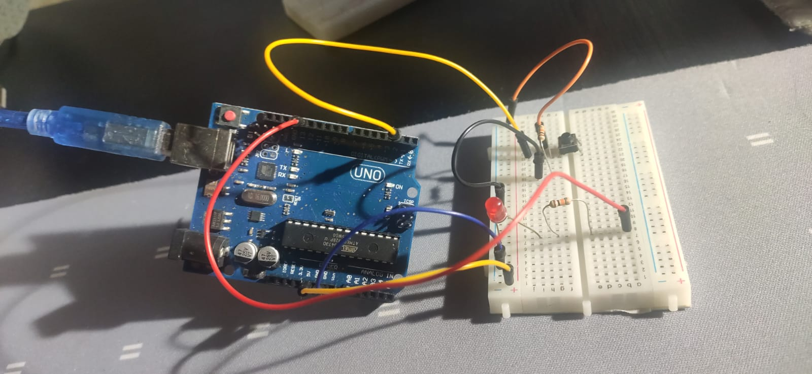
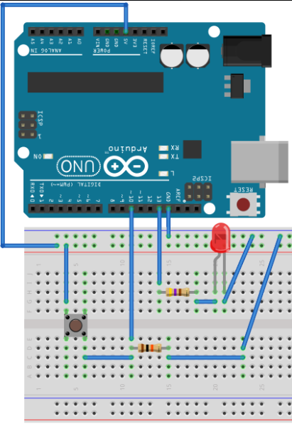

# **CREATIVE PROJECTS:** :books::brain:

<br>

### This is the ***root directory*** of **Arduino** project with **Python**: :mortar_board::closed_book::robot:

<br>

# **SUMÁRIO:** :round_pushpin:

<br>

- ### **[Installing and Setting up](#installing-and-setting-up)** :man_student::books:
  - #### [**Setting up Arduino Hardware**](#setting-up-arduino-hardware)
  - #### [**Install Arduino IDE**](#install-arduino-ide)
  - #### [**Install Arduino-Python3 Command API**](#install-arduino-python3-command-api)
  - #### [**Setup**](#setup)
  - #### [**Setting up Arduino Hardware**](#setting-up-arduino-hardware)
  - #### [**Code**](#code)

<br>

# **Installing and Setting up**:
**[Back to top](#creative-projects-booksbrain) :point_left::top:**

- ## **Install Arduino IDE:**
    **[Back to top](#creative-projects-booksbrain) :point_left::top:**

    - [Access to install](https://www.arduino.cc/en/software) !


- ## **Install Arduino-Python3 Command API:**
    **[Back to top](#creative-projects-booksbrain) :point_left::top:**

    - [Access for documentation](https://pypi.org/project/arduino-python3/) !
    - [Access for GitHub directory](https://github.com/DanScherr/Python-Arduino-Command-API) !
    - ```pip install arduino-python3```
    - ou ```python setup.py build install```


- ## **Setup:**
    **[Back to top](#creative-projects-booksbrain) :point_left::top:**

    - Verify that your Arduino board communicates at the baud rate specified in the setup() function (line 407) in [prototype.ino](./arduino-function/prototype.ino). Change it there if necessary.
    - **Load the prototype.ino sketch onto your Arduino board**, using the [Arduino IDE](#install-arduino-ide).
        - ## Installing libraries on Arduino:
          - Your Arduino might ask to install the Servo library.
          - For that, [check this tutorial](https://docs.arduino.cc/software/ide-v1/tutorials/installing-libraries).
            - Search for the **Servos** library.

    - Set up some kind of serial I/O communication between the Arduino board and your computer (via physical USB cable, Bluetooth, xbee, etc. + associated drivers)
    - Add from Arduino import Arduino into your python script to communicate with your Arduino
        - Check [test_main.ipynb](./test_main.ipynb) file.
    - For a collection of examples, see examples.py (on GitHub directory). This file contains methods which replicate the functionality of many Arduino demo sketches.
      - This folder aims to replicate one of the examples on file [test_main.ipynb](./test_main.ipynb).

- ## **Setting up Arduino Hardware:**
    **[Back to top](#creative-projects-booksbrain) :point_left::top:**

    - Real life picture:

    

    - Graphic picture:

    

    - Diagram illustration:

    

- ## **Code**:
    **[Back to top](#creative-projects-booksbrain) :point_left::top:**

    - [Check for code.](./test_main.ipynb)

<br>

***

<br>

- ### **Please, be welcome to check my profile:** :nerd_face::handshake:

<br>

<a href="https://github.com/DanScherr">
    
</a>


